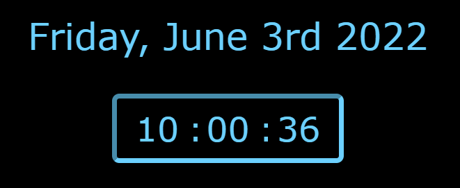

# Functional Clock
  ### A simple clock design created with HTML/CSS/JavaScript
  
  
  
  ## Summary
  This was my first adventure into Javascript! While many of the previous programming concepts carried over from my
  exprience with other languages, there were some challenges getting the display to dynamically update with JavaScript and 
  overwrite the base HTML code. This was also a fun experiment in designing and styling with CSS.
  
  ## Author
  Brandon Chamberlain - Apprentice Software Developer | [LinkedIn](https://www.linkedin.com/in/bchamberlain3618/) | 
  [Personal Website](https://www.thebrandonchamberlain.com)
